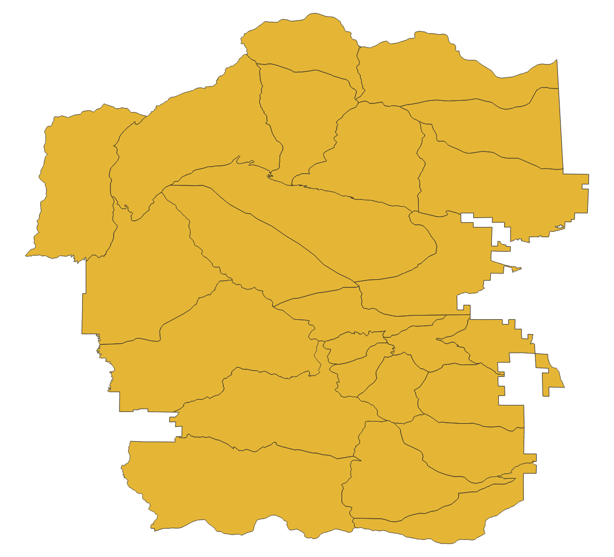
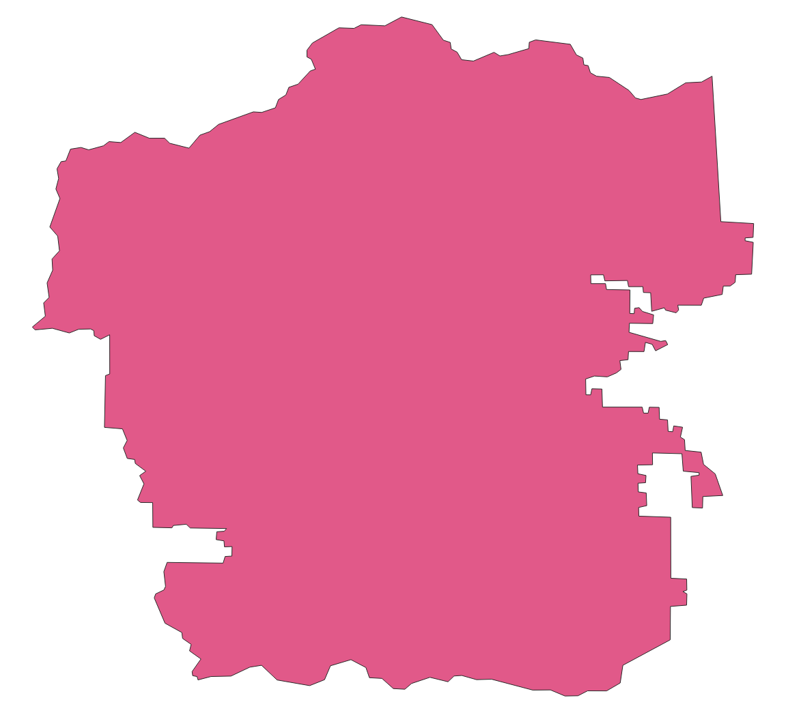
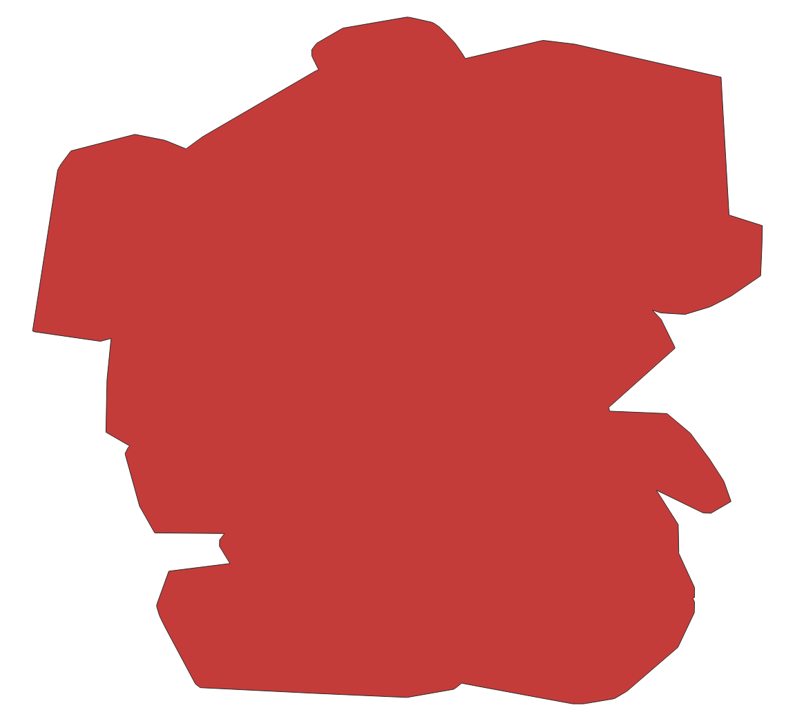
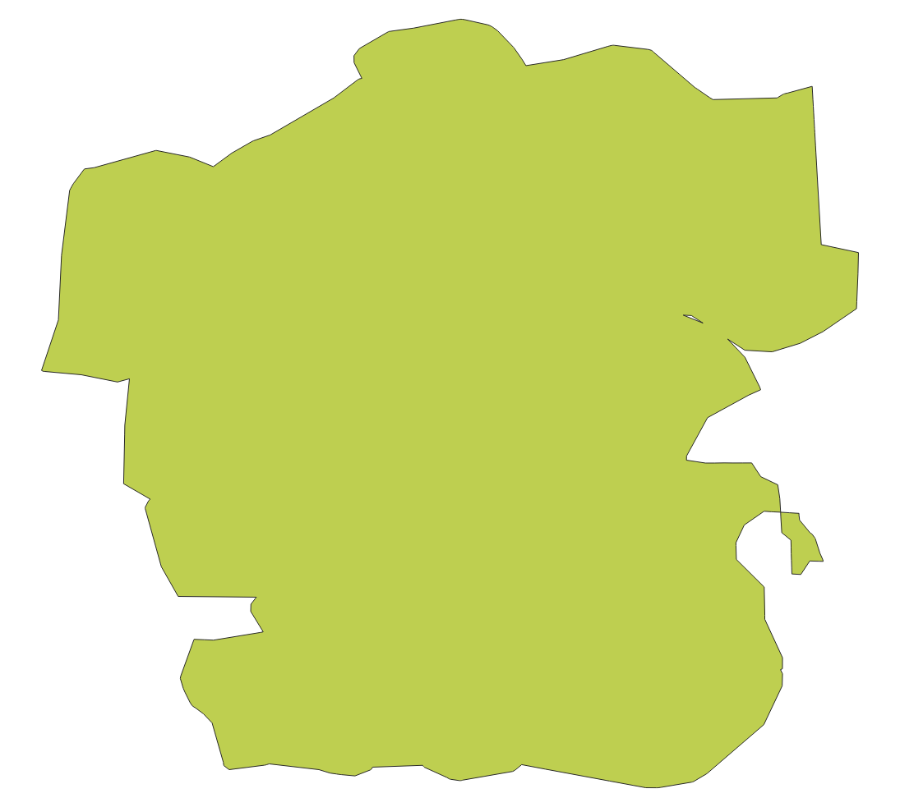

Command Line Interface
======================

Fiona's new command line interface is a program named "fio".

.. code-block:: console

    Usage: fio [OPTIONS] COMMAND [ARGS]...

      Fiona command line interface.

    Options:
      -v, --verbose           Increase verbosity.
      -q, --quiet             Decrease verbosity.
      --aws-profile TEXT      Select a profile from the AWS credentials file
      --aws-no-sign-requests  Make requests anonymously
      --aws-requester-pays    Requester pays data transfer costs
      --version               Show the version and exit.
      --gdal-version          Show the version and exit.
      --python-version        Show the version and exit.
      --help                  Show this message and exit.

    Commands:
      bounds   Print the extent of GeoJSON objects
      calc     Calculate GeoJSON property by Python expression
      cat      Concatenate and print the features of datasets
      collect  Collect a sequence of features.
      distrib  Distribute features from a collection.
      dump     Dump a dataset to GeoJSON.
      env      Print information about the fio environment.
      filter   Evaluate pipeline expressions to filter GeoJSON features.
      info     Print information about a dataset.
      insp     Open a dataset and start an interpreter.
      load     Load GeoJSON to a dataset in another format.
      ls       List layers in a datasource.
      map      Map a pipeline expression over GeoJSON features.
      reduce   Reduce a stream of GeoJSON features to one value.
      rm       Remove a datasource or an individual layer.

It is developed using the ``click`` package.

bounds
------

The bounds command reads LF or RS-delimited GeoJSON texts, either features or
collections, from stdin and prints their bounds with or without other data to
stdout.

With no options, it works like this:

.. code-block:: console

    $ fio cat docs/data/test_uk.shp | head -n 1 \
    > | fio bounds
    [0.735, 51.357216, 0.947778, 51.444717]

Using ``--with-id`` gives you

.. code-block:: console

    $ fio cat docs/data/test_uk.shp | head -n 1 \
    > | fio bounds --with-id
    {"id": "0", "bbox": [0.735, 51.357216, 0.947778, 51.444717]}

calc
----

The calc command creates a new property on GeoJSON features using the
specified expression.

The expression is evaluated in a restricted namespace containing 4 functions
(`sum`, `pow`, `min`, `max`), the `math` module, the shapely `shape` function,
type conversions (`bool`, `int`, `str`, `len`, `float`), and an object `f`
representing the feature to be evaluated. This `f` object allows access in
javascript-style dot notation for convenience.

The expression will be evaluated for each feature and its return value will be
added to the properties as the specified property_name. Existing properties
will not be overwritten by default (an `Exception` is raised).

.. code-block:: console

    $ fio cat data.shp | fio calc sumAB  "f.properties.A + f.properties.B"

.. note::

   ``fio calc`` requires installation of the "calc" set of extra requirements
   that will be installed by ``pip install fiona[calc]``.

cat
---

The cat command concatenates the features of one or more datasets and prints
them as a `JSON text sequence
<https://datatracker.ietf.org/doc/html/rfc7464>`__ of features.
In other words: GeoJSON feature objects, possibly pretty printed, optionally
separated by ASCII RS (\x1e) chars using `--rs`.

The output of ``fio cat`` can be piped to ``fio load`` to create new
concatenated datasets.

.. code-block:: console

    $ fio cat docs/data/test_uk.shp docs/data/test_uk.shp \
    > | fio load /tmp/double.shp --driver Shapefile
    $ fio info /tmp/double.shp --count
    96
    $ fio info docs/data/test_uk.shp --count
    48

The cat command provides optional methods to filter data, which are
different to the ``fio filter`` tool.
A bounding box ``--bbox w,s,e,n`` tests for a spatial intersection with
the geometries. An attribute filter ``--where TEXT`` can use
an `SQL WHERE clause <https://gdal.org/user/ogr_sql_dialect.html#where>`__.
If more than one datasets is passed to ``fio cat``, the attributes used
in the WHERE clause must be valid for each dataset.

collect
-------

The collect command takes a JSON text sequence of GeoJSON feature objects, such
as the output of ``fio cat`` and writes a GeoJSON feature collection.

.. code-block:: console

    $ fio cat docs/data/test_uk.shp docs/data/test_uk.shp \
    > | fio collect > /tmp/collected.json
    $ fio info /tmp/collected.json --count
    96

distrib
-------

The inverse of fio-collect, fio-distrib takes a GeoJSON feature collection
and writes a JSON text sequence of GeoJSON feature objects.

.. code-block:: console

    $ fio info --count tests/data/coutwildrnp.shp
    67
    $ fio cat tests/data/coutwildrnp.shp | fio collect | fio distrib | wc -l
    67

dump
----

The dump command reads a vector dataset and writes a GeoJSON feature collection
to stdout. Its output can be piped to ``fio load`` (see below).

.. code-block:: console

    $ fio dump docs/data/test_uk.shp --indent 2 --precision 2 | head
    {
      "features": [
        {
          "geometry": {
            "coordinates": [
              [
                [
                  0.9,
                  51.36
                ],

You can optionally dump out JSON text sequences using ``--x-json-seq``. Since
version 1.4.0, ``fio cat`` is the better tool for generating sequences.

.. code-block:: console

    $ fio dump docs/data/test_uk.shp --precision 2 --x-json-seq | head -n 2
    {"geometry": {"coordinates": [[[0.9, 51.36], [0.89, 51.36], [0.79, 51.37], [0.78, 51.37], [0.77, 51.38], [0.76, 51.38], [0.75, 51.39], [0.74, 51.4], [0.73, 51.41], [0.74, 51.43], [0.75, 51.44], [0.76, 51.44], [0.79, 51.44], [0.89, 51.42], [0.9, 51.42], [0.91, 51.42], [0.93, 51.4], [0.94, 51.39], [0.94, 51.38], [0.95, 51.38], [0.95, 51.37], [0.95, 51.37], [0.94, 51.37], [0.9, 51.36], [0.9, 51.36]]], "type": "Polygon"}, "id": "0", "properties": {"AREA": 244820.0, "CAT": 232.0, "CNTRY_NAME": "United Kingdom", "FIPS_CNTRY": "UK", "POP_CNTRY": 60270708.0}, "type": "Feature"}
    {"geometry": {"coordinates": [[[-4.66, 51.16], [-4.67, 51.16], [-4.67, 51.16], [-4.67, 51.17], [-4.67, 51.19], [-4.67, 51.19], [-4.67, 51.2], [-4.66, 51.2], [-4.66, 51.19], [-4.65, 51.16], [-4.65, 51.16], [-4.65, 51.16], [-4.66, 51.16]]], "type": "Polygon"}, "id": "1", "properties": {"AREA": 244820.0, "CAT": 232.0, "CNTRY_NAME": "United Kingdom", "FIPS_CNTRY": "UK", "POP_CNTRY": 60270708.0}, "type": "Feature"}

info
----

The info command prints information about a dataset as a JSON object.

.. code-block:: console

    $ fio info docs/data/test_uk.shp --indent 2
    {
      "count": 48,
      "crs": "+datum=WGS84 +no_defs +proj=longlat",
      "driver": "ESRI Shapefile",
      "bounds": [
        -8.621389,
        49.911659,
        1.749444,
        60.844444
      ],
      "schema": {
        "geometry": "Polygon",
        "properties": {
          "CAT": "float:16",
          "FIPS_CNTRY": "str:80",
          "CNTRY_NAME": "str:80",
          "AREA": "float:15.2",
          "POP_CNTRY": "float:15.2"
        }
      }
    }

You can process this JSON using, e.g., 
`underscore-cli <https://github.com/ddopson/underscore-cli>`__.

.. code-block:: console

    $ fio info docs/data/test_uk.shp | underscore extract count
    48

You can also optionally get single info items as plain text (not JSON) 
strings

.. code-block:: console

    $ fio info docs/data/test_uk.shp --count
    48
    $ fio info docs/data/test_uk.shp --bounds
    -8.621389 49.911659 1.749444 60.844444

load
----

The load command reads GeoJSON features from stdin and writes them to a vector
dataset using another format.

.. code-block:: console

    $ fio dump docs/data/test_uk.shp \
    > | fio load /tmp/test.shp --driver Shapefile

This command also supports GeoJSON text sequences. RS-separated sequences will
be detected. If you want to load LF-separated sequences, you must specify
``--x-json-seq``.

.. code-block:: console

    $ fio cat docs/data/test_uk.shp | fio load /tmp/foo.shp --driver Shapefile
    $ fio info /tmp/foo.shp --indent 2
    {
      "count": 48,
      "crs": "+datum=WGS84 +no_defs +proj=longlat",
      "driver": "ESRI Shapefile",
      "bounds": [
        -8.621389,
        49.911659,
        1.749444,
        60.844444
      ],
      "schema": {
        "geometry": "Polygon",
        "properties": {
          "AREA": "float:24.15",
          "CNTRY_NAME": "str:80",
          "POP_CNTRY": "float:24.15",
          "FIPS_CNTRY": "str:80",
          "CAT": "float:24.15"
        }
      }
    }

The underscore-cli process command is another way of turning a GeoJSON feature
collection into a feature sequence.

.. code-block:: console

    $ fio dump docs/data/test_uk.shp \
    > | underscore process \
    > 'each(data.features,function(o){console.log(JSON.stringify(o))})' \
    > | fio load /tmp/test-seq.shp --x-json-seq --driver Shapefile

filter
------

For each feature read from stdin, filter evaluates a pipeline of one or
more steps described using methods from the Shapely library in Lisp-like
expressions. If the pipeline expression evaluates to True, the feature passes
through the filter. Otherwise the feature does not pass.

For example, this pipeline expression

.. code-block:: console

    $ fio cat zip+https://s3.amazonaws.com/fiona-testing/coutwildrnp.zip \
    | fio filter '< (distance g (Point -109.0 38.5)) 100'

lets through all features that are less than 100 meters from the given point
and filters out all other features.

*New in version 1.10*: these parenthesized list expressions.

The older style Python expressions like

.. code-block::

    'f.properties.area > 1000.0'

are deprecated and will not be supported in version 2.0.

Note this tool is different from ``fio cat --where TEXT ...``, which provides
SQL WHERE clause filtering of feature attributes.

.. note::

   ``fio filter`` requires installation of the "calc" set of extra requirements
   that will be installed by ``pip install fiona[calc]``.

map
---

For each feature read from stdin, ``fio map`` applies a transformation pipeline and
writes a copy of the feature, containing the modified geometry, to stdout. For
example, polygonal features can be roughly "cleaned" by using a ``buffer g 0``
pipeline.

.. code-block:: console

    $ fio cat zip+https://s3.amazonaws.com/fiona-testing/coutwildrnp.zip \
    | fio map 'buffer g 0'

*New in version 1.10*.

.. note::

   ``fio map`` requires installation of the "calc" set of extra requirements
   that will be installed by ``pip install fiona[calc]``.

reduce
------

Given a sequence of GeoJSON features (RS-delimited or not) on stdin this prints
a single value using a provided transformation pipeline.  The set of geometries
of the input features in the context of these expressions is named ``c``.

For example, the pipeline expression

.. code-block:: console

    $ fio cat zip+https://s3.amazonaws.com/fiona-testing/coutwildrnp.zip \
    | fio reduce 'unary_union c'

dissolves the geometries of input features.

*New in version 1.10*.

.. note::

   ``fio reduce`` requires installation of the "calc" set of extra requirements
   that will be installed by ``pip install fiona[calc]``.

rm
--

The rm command deletes an entire datasource or a single layer in a multi-layer
datasource. If the datasource is composed of multiple files (e.g. an ESRI
Shapefile) all of the files will be removed.

.. code-block:: console

    $ fio rm countries.shp
    $ fio rm --layer forests land_cover.gpkg

Expressions and functions
-------------------------

``fio filter``, ``fio map``, and ``fio reduce`` expressions take the form of
parenthesized lists that may contain other expressions. The first item in a
list is the name of a function or method, or an expression that evaluates to a
function. The second item is the function's first argument or the object to
which the method is bound. The remaining list items are the positional and
keyword arguments for the named function or method. The list of functions and
callables available in an expression includes:

* Python operators such as ``+``, ``/``, and ``<=``
* Python builtins such as ``dict``, ``list``, and ``map``
* All public functions from itertools, e.g. ``islice``, and ``repeat``
* All functions importable from Shapely 2.0, e.g. ``Point``, and ``unary_union``
* All methods of Shapely geometry classes
* Functions specific to Fiona

Expressions are evaluated by ``fiona.features.snuggs.eval()``. Let's look at
some examples using that function.

.. note::

   The outer parentheses are not optional within ``snuggs.eval()``.

.. note::

   ``snuggs.eval()`` does not use Python's builtin ``eval()`` but isn't intended
   to be a secure computing environment. Expressions which access the
   computer's filesystem and create new processes are possible.

Builtin Python functions
------------------------

``bool()``

.. code-block:: python

    >>> snuggs.eval('(bool 0)')
    False

``range()``

.. code-block:: python

    >>> snuggs.eval('(range 1 4)')
    range(1, 4)

``list()``

.. code-block:: python

    >>> snuggs.eval('(list (range 1 4))')
    [1, 2, 3]

Values can be bound to names for use in expressions.

.. code-block:: python

    >>> snuggs.eval('(list (range start stop))', start=0, stop=5)
    [0, 1, 2, 3, 4]

Itertools functions
-------------------

Here's an example of using ``itertools.repeat()``.

.. code-block:: python

    >>> snuggs.eval('(list (repeat "*" times))', times=6)
    ['*', '*', '*', '*', '*', '*']

Shapely functions
-----------------

Here's an expression that evaluates to a Shapely Point instance.

.. code-block:: python

    >>> snuggs.eval('(Point 0 0)')
    <POINT (0 0)>

The expression below evaluates to a MultiPoint instance.

.. code-block:: python

    >>> snuggs.eval('(union (Point 0 0) (Point 1 1))')
    <MULTIPOINT (0 0, 1 1)>

Functions specific to fiona
---------------------------

The fio CLI introduces four new functions not available in Python's standard
library, or Shapely: ``collect()``, ``dump()``, ``identity()``, and
``vertex_count()``.

The ``collect()`` function turns a list of geometries into a geometry
collection and ``dump()`` does the inverse, turning a geometry collection into
a sequence of geometries.

.. code-block:: python

    >>> snuggs.eval('(collect (Point 0 0) (Point 1 1))')
    <GEOMETRYCOLLECTION (POINT (0 0), POINT (1 1))>
    >>> snuggs.eval('(list (dump (collect (Point 0 0) (Point 1 1))))')
    [<POINT (0 0)>, <POINT (1 1)>]

The ``identity()`` function returns its single argument.

.. code-block:: python

    >>> snuggs.eval('(identity 42)')
    42

To count the number of vertices in a geometry, use ``vertex_count()``.

.. code-block:: python

    >>> snuggs.eval('(vertex_count (Point 0 0))')
    1

The ``area()``, ``buffer()``, ``distance()``, ``length()``, ``simplify()``, and
``set_precision()`` functions shadow, or override, functions from the shapely
module. They automatically reproject geometry objects from their natural
coordinate reference system (CRS) of ``OGC:CRS84`` to ``EPSG:6933`` so that the
shapes can be measured or modified using meters as units.

``buffer()`` dilates (or erodes) a given geometry, with coordinates in decimal
longitude and latitude degrees, by a given distance in meters.

.. code-block:: python

    >>> snuggs.eval('(buffer (Point 0 0) :distance 100)')
    <POLYGON ((0.001 0, 0.001 0, 0.001 0, 0.001 0, 0.001 -0.001, 0.001 -0.001, 0...>

The ``area()`` and ``length()`` of this polygon have units of square meter and
meter.

.. code-block:: python

    >>> snuggs.eval('(area (buffer (Point 0 0) :distance 100))')
    31214.451487413342
    >>> snuggs.eval('(length (buffer (Point 0 0) :distance 100))')
    627.3096977558143

The ``distance()`` between two geometries is in meters.

.. code-block:: python

    >>> snuggs.eval('(distance (Point 0 0) (Point 0.1 0.1))')
    15995.164946207413

A geometry can be simplified to a tolerance value in meters using
``simplify()``.  There are more examples of this function later in this
document.

.. code-block:: python

    >>> snuggs.eval('(simplify (buffer (Point 0 0) :distance 100) :tolerance 100)')
    <POLYGON ((0.001 0, 0 -0.001, -0.001 0, 0 0.001, 0.001 0))>

The ``set_precision()`` function snaps a geometry to a fixed precision grid
with a size in meters.

.. code-block:: python

    >>> snuggs.eval('(set_precision (Point 0.001 0.001) :grid_size 500)')
    <POINT (0 0)>

Feature and geometry context for expressions
--------------------------------------------

``fio filter`` and ``fio map`` evaluate expressions in the context of a GeoJSON
feature and its geometry attribute. These are named ``f`` and ``g``. For example,
here is an expression that tests whether the input feature is within 62.5
kilometers of the given point.

.. code-block:: lisp

   < (distance g (Point 4 43)) 62.5E3

``fio reduce`` evaluates expressions in the context of the sequence of all input
geometries, named ``c``. For example, this expression dissolves input
geometries using Shapely's ``unary_union``.

.. code-block:: lisp

   unary_union c

Coordinate Reference System Transformations
-------------------------------------------

The ``fio cat`` command can optionally transform feature geometries to a new
coordinate reference system specified with ``--dst_crs``. The ``fio collect``
command can optionally transform from a coordinate reference system specified
with ``--src_crs`` to the default WGS84 GeoJSON CRS. Like collect, ``fio load``
can accept non-WGS84 features, but as it can write files in formats other than
GeoJSON, you can optionally specify a ``--dst_crs``. For example, the WGS84
features read from docs/data/test_uk.shp,

.. code-block:: console

     $ fio cat docs/data/test_uk.shp --dst_crs EPSG:3857 \
     > | fio collect --src_crs EPSG:3857 > /tmp/foo.json

make a detour through EPSG:3857 (Web Mercator) and are transformed back to WGS84
by fio cat. The following,

.. code-block:: console

    $ fio cat docs/data/test_uk.shp --dst_crs EPSG:3857 \
    > | fio load --src_crs EPSG:3857 --dst_crs EPSG:4326 --driver Shapefile \
    > /tmp/foo.shp

does the same thing, but for ESRI Shapefile output.

Sizing up and simplifying shapes
--------------------------------

The following examples use the program ``jq`` and a 25-feature shapefile. You
can get the data from from `rmnp.zip
<https://github.com/Toblerity/Fiona/files/14749922/rmnp.zip>`__ or access it in
a streaming fashion as shown in the examples below.

Counting vertices in a feature collection
+++++++++++++++++++++++++++++++++++++++++

The builtin ``vertex_count()`` function, in conjunction with ``fio map``'s
``--raw`` option, prints out the number of vertices in each feature. The
default for fio-map is to wrap the result of every evaluated expression in
a GeoJSON feature; ``--raw`` disables this. The program ``jq`` provides a nice
way of summing the sequence of numbers.

.. code-block:: console

    fio cat zip+https://github.com/Toblerity/Fiona/files/14749922/rmnp.zip \
    | fio map 'vertex_count g' --raw \
    | jq -s 'add'
    28915

Here's what the RMNP wilderness patrol zones features look like in QGIS.

Counting vertices after making a simplified buffer
++++++++++++++++++++++++++++++++++++++++++++++++++

One traditional way of simplifying an area of interest is to buffer and
simplify. There's no need to use ``jq`` here because ``fio reduce`` prints out
a sequence of exactly one feature. The effectiveness of this method depends
a bit on the nature of the data, especially the distance between vertices. The
total length of the perimeters of all zones is 889 kilometers.

.. code-block:: console

    fio cat zip+https://github.com/Toblerity/Fiona/files/14749922/rmnp.zip \
    | fio map 'length g' --raw \
    | jq -s 'add'
    889332.0900809917

The mean distance between vertices on the edges of zones is 889332 / 28915, or
30.7 meters.  You need to buffer and simplify by this value or more to get
a significant reduction in the number of vertices. Choosing 40 as a buffer
distance and simplification tolerance results in a shape with 469 vertices.
It's a suitable area of interest for applications that require this number to
be less than 500.

.. code-block:: console

    fio cat zip+https://github.com/Toblerity/Fiona/files/14749922/rmnp.zip \
    | fio reduce 'unary_union c' \
    | fio map 'simplify (buffer g 40) 40' \
    | fio map 'vertex_count g' --raw
    469

Counting vertices after dissolving convex hulls of features
+++++++++++++++++++++++++++++++++++++++++++++++++++++++++++

Convex hulls are an easy means of simplification as there are no distance
parameters to tweak. The ``--dump-parts`` option of ``fio map`` turns the parts of
multi-part features into separate single-part features. This is one of the ways
in which fio-map can multiply its inputs, printing out more features than it
receives.

.. code-block:: console

    fio cat zip+https://github.com/Toblerity/Fiona/files/14749922/rmnp.zip \
    | fio map 'convex_hull g' --dump-parts \
    | fio reduce 'unary_union c' \
    | fio map 'vertex_count g' --raw
    157

Counting vertices after dissolving concave hulls of features
++++++++++++++++++++++++++++++++++++++++++++++++++++++++++++

Convex hulls simplify, but also dilate concave areas of interest. They fill the
"bays", so to speak, and this can be undesirable. Concave hulls do a better job
at preserving the concave nature of a shape and result in a smaller increase of
area.

.. code-block:: console

    fio cat zip+https://github.com/Toblerity/Fiona/files/14749922/rmnp.zip \
    | fio map 'concave_hull g :ratio 0.4' --dump-parts \
    | fio reduce 'unary_union c' \
    | fio map 'vertex_count g' --raw
    301

